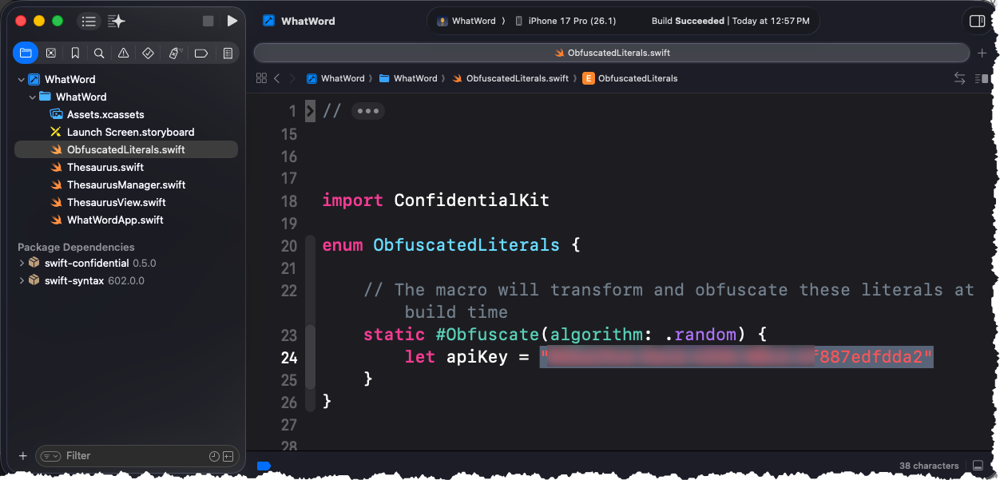

# API Key Obfuscation 

 This is the starter project for the video API Key Obfuscation 

<a href="http://www.youtube.com/watch?feature=player_embedded&v=FfXK0IrX0p0
" target="_blank"></a>

> Note:  I originally created a video on using SwiftUI Conditional but since that time, the installation and usage has changed and in fact it is much easier.  You no longer need to install the plugin nor do you need to create the YAML file to configure the obfuscation.

A large part of the video https://www.youtube.com/watch?v=FfXK0IrX0p0 is still relevant so let me first point out to you which parts of the video are, then I will show you how you can now implement SwiftUI Confidential.

1. The first three sections of the video are still valid.

   [0:00](https://www.youtube.com/watch?v=FfXK0IrX0p0)  Introduction 

   [2:55](https://www.youtube.com/watch?v=FfXK0IrX0p0&t=175s) Getting your API Key 

   [4:32](https://www.youtube.com/watch?v=FfXK0IrX0p0&t=272s) Finding Embedded Strings in compiled Apps

2. The next part of the video from 8:30 up until 15:45 however is no longer valid and you can replace it with the following steps

## The SwiftUI Confidential package

You now only need to install the **SwiftUI Confidential** package and not the plugin.

Add Swift Confidential to your SwiftPM or Xcode project. See the relevant installation instructions in the expandable sections below.

1. Select `File` > `Add Package Dependencies...`.
2. In the `Search or Enter Package URL` field, enter the following URL:
   ```
   https://github.com/securevale/swift-confidential.git
   ```
3. Change the `Dependency Rule` to `Up to Next Minor Version`.
4. Click the `Add Package` button.
5. Select the target to which you want to add the `ConfidentialKit` package product and click the `Add Package` button.

## Creating an ObfuscationLiterals Enum file

1. The simplest method, rather than creating a YAML file is to create a new file in your project called **ObfuscationLiterals.swift**

> **Note:** This file must not be committed to source control and pushed up to your repository. See the section below on how to exclude this file from source control.

2. `Import ConfidentialKit`

3. Create an enum called **ObfuscationLiterals**

4. Create a static **#Obfuscate** block inside of the ObfuscationLiterals enum

   1. This block can have 0 or more algorithms applied to it.  If you leave it empty, then the property defined will be obfuscated using a randomly generated obfuscation algorithm.

   ```swift
   import ConfidentialKit
   
   enum ObfuscatedLiterals {
       static #Obfuscate {
           // this will generate a random obfuscation algorithm for the apiKey property
           let apiKey = "32an5uT-873zd-4336-88c1-4f887edfdda2!"
       }
   }
   ```

   2. If you prefer, you can also specify a number of different obfuscation techniques as the algorithm argument to #Obfuscate

   ```swift
   Import ConfidentialKit
   
   enum ObfuscatedLiterals {
       static #Obfuscate(algorithm: .custom([.encrypt(algorithm: .aes192GCM), .shuffle])) {
           let apiKey = "32an5uT-873zd-4336-88c1-4f887edfdda2!"
       }
   }
   ```



## Replace your hard coded literals

In your project, replace your hard coded literals with ObfuscatedLiteral defined in the ObfuscationLiterals enum

```swift
 private let apiKey = ObfuscatedLiterals.$apiKey
```

This is all you need to do to obfuscate your hard coded literals.  When you build your project, the ObfuscatedLiterals enum will be obfuscated and the hard coded literals will be replaced with obfuscated values,  if you were to Archive your project and inspect the strings as described in the video starting at

[4:32](https://www.youtube.com/watch?v=FfXK0IrX0p0&t=272s) Finding Embedded Strings in compiled Apps

You will not find that apiKey string in the compiled app's embedded strings.  It has been obfuscated.

## Exclude the ObfuscationLiterals.swift file from source control

The final step is to exclude the ObfuscationLiterals.swift file from source control.  In the video, at this pooint
[16:10](https://www.youtube.com/watch?v=FfXK0IrX0p0&t=970s) Excluding the YAML file from Source Control

How to exclude the YAML file from Source Control.  The process is identical, except that now, you will be excluding the ObfuscationLiterals.swift file rather than the **confidential.yml** file.

If you want to support my work, you can - </br>

<a href='https://ko-fi.com/Z8Z22WRVG' target='_blank'></a>

